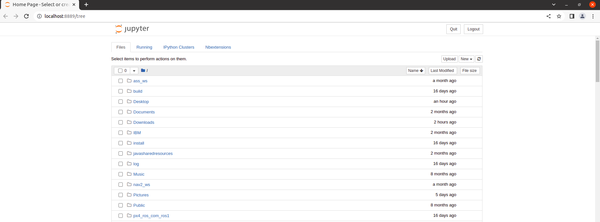
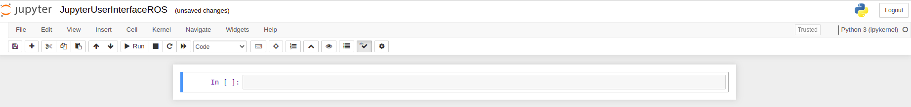

[Research Track 2_Assignment 2](https://corsi.unige.it/off.f/2021/ins/51207) <br>
Course Instructor: [Prof. CARMINE RECCHIUTO](https://rubrica.unige.it/personale/UkNDWV1r) <br>

## GUI for Robot Control using JupyterNotebook 

## Abstract ##
[Jupyter Notebook](https://jupyter.org/) is an open source web application which is used to create and share documents that contain real-time code, equation, data visualizations, text, and so on. This Jupyetr Nootebook is designed to create the GUI for Mobile Robot Control. Also, this notebook is developed as an user interface. For this, ***Jupyter Notebook*** tool is used.

## Introduction ##
Jupyter Notebooks are a spin-off project from the IPython project, which is used to have an IPython
Notebook project itself. The _IPython Kernel_, which allows us to write our program in Python, but there are currently over 100 other kernels that can also be used. The Jupyter Notebook is not included with Python, so if we want to try it out, we will need to install Jupyter on our system.

## Installation
To create Jupyter Interface, *Jupyter Notebook* tool is required on your system. To install Jupyter follow the steps given below:

```
pip3 install jupyter bqplot pyyaml ipywidgets
```
```
jupyter nbextension enable --py widgetsnbextension
```

* **Note:** If you find errors such as *ImportError: No module named widgetsnbextension*. To resolve such kind of error follow the below links.
      <ul>
      <li>[Link 1](http://github.com/jupyter-widgets/pywidgets/issues/568) to know what actual the erro is about.</li>
      <li>[Link 2](http://lpywidgets.readthedocs.io/en/stable/user_install.html) command to resolve the error.</li>
      </ul>


Now, with these two commands Jupyter is installed, let’s start with the interface of the project **Mobile Robot Control**. To get started, all you need to do is open up your terminal application and go to a folder of your choice. Then run the below command:
```
jupyter notebook --allow-root
```
*Note:* The ***--allow-root*** option is only necessary if you are using the Docker Image.
Also, in the docker you will probably need to update firefox with ```apt-get install firefox```)

Below is the figure which shows ***Notebook Server***. 

 

Now, click on the *New* button on the right corner as shown in the figure above. After clicking on this button, it will open a dialogue box which shows the list. Aslo, this python versions installed in your system. In the *Docker image* you should have only Python3 installed. 

 

Figure above shows the first Jupyter Document web page.

## Jupyter and ROS

Jupyter Notebooks may be used and integrated with ROS called as [Jupyter-Ros](https://jupyter-ros.readthedocs.io/en/latest/). As for the other libraries, we need to install some extensions: 
```
pip3 install jupyros
```
For the publishing, the package contains tools to automatically generate widgets from message definitions. 
```
import jupyros as jr
import rospy
from std_msgs.msg import String
rospy.init_node('jupyter_node')
jr.publish('/sometopic', String)
```
This results in a jupyter widget where one can insert the desired message in the text field. The form fields (jupyter widgets) are generated automatically from the message definition. If we use a a different message type, we will get different fields.

**ROS3D** communicates with ROS via websocket. This communication is configured through the jupyter widgets protocol, but you are also required to run the *“rosbridge websocket”* package in your ROS environment (or launch file). For this, you need to make sure that you have ros-noetic-rosbridge-suite and ros-noetic-tf2-webrepublisher. Thus, for this example, install:
```
apt-get install ros-noetic-rosbridge-suit
```
```
apt-get install ros-noetic-tf2-web-republisher
```
```
apt-get install ros-noetic-slam-gmapping
```
```
apt-get install ros-noetic-move-base
```
For non-Docker Image user execute the aforementioned command by adding ***sudo*** in front. 

## Jupyter notebook Package ##
This package includes Jupyter Notebooks, which act as a user interface node and assist in controlling the robot in the gazebo environment. This node will have a graphical interface with a Jupyter notebook for starting and stopping the robot, controlling the robot in the desired direction, and also analyzing various plots. In the action package, the user interface is simply a command line interface through which the user can "start" or "stop" the robot.

## Jupyter Notebook desription ##
Plots, buttons is for controlling the robot, and displays for various analysis data on the robot's state are all included in the Jupyter Notebook. The buttons and plots that this node can offer are listed below.

## Description of the Jupyter Code ##

The Jupyter user interface node is a super easy node. This is used to control the robot's behaviour. This implementation will demonstrates that robot's behavior such as switching to the different modalities.


#### First, imported the required libraries as given below ####
```
%matplotlib widget
import numpy as npy
import collections
import jupyros as jr
import rospy
import time
import actionlib
import actionlib.msg
import rt2_assignment1.msg
from geometry_msgs.msg import Twist
from rt2_assignment1.srv import Command
from rosgraph_msgs.msg import Clock
from nav_msgs.msg import Odometry
import matplotlib.pyplot as plot
from matplotlib import animation, rc
import matplotlib.ticker as ticker
from ipywidgets import Button, Layout, ButtonStyle, GridBox, VBox, HBox ,Box ,AppLayout , GridspecLayout
import ipywidgets as widgets
```

#### Buttons Control ####
Buttons to control the holomonic robot in the gazebo environment
six buttons are provided in this block to manually control the robot. The buttons are used to define robot;s direction and it is publishing to the topic /cmd_vel.

A start button used to trigger the "go_to_point" random movement of the robot and a stop button is provided to set all the robot velocities to zero. The buttons are implement using a service client that send a "start"/"stop" string to the "Command" service.
Also,there are forward,backward,right and left buttons which are used to move the robot in a required direction.

```
start  = Button(description='Start',layout=Layout(width='auto', align="center", grid_area='Start'),style=ButtonStyle(button_color='green'))
stop  = Button(description='Stop',layout=Layout(width='auto', grid_area='Stop'),style=ButtonStyle(button_color='red'))
forward  = Button(description='Forward',layout=Layout(width='auto', align="center", grid_area='W'),style=ButtonStyle(button_color='cyan'))
left  = Button(description='Left',layout=Layout(width='auto', grid_area='left'),style=ButtonStyle(button_color='cyan'))
right = Button(description='Right',layout=Layout(width='auto', grid_area='right'),style=ButtonStyle(button_color='cyan'))
backward = Button(description='Backward',layout=Layout(width='auto', grid_area='backward'),style=ButtonStyle(button_color='cyan'))
output = widgets.Output()
```

#### Start,Stop,foreward,backward,left,right buttons ####
The robot may be manually started and stopped with this button, and it can also be moved in any direction using the forward, backward, left, and right buttons. These buttons provide as a means of requesting customer service.

#### Funcion of buttons ####

```
def start_robot(start):
    global random_moving,task_time,ui_client
    with output:
        setting_linear = 1.0
        setting_angular = 1.0
    ui_client("start")
    random_moving=True
    task_time=rospy.Time.now()
    print('Start is been activated and robot is moving')
        

def stop_robot(stop):
    global random_moving,cancelled_targets
    with output:
        ui_client("stop")
        if random_moving == False:
            print("I was already stopped")
        random_moving = False 
        cancelled_targets=cancelled_targets+1
        task_time=0
        print('Stop is activated and robot will be stopped')
        
def move_forward(forward):
    global random_moving, setting_linear, setting_linear,cancelled_targets
    if random_moving == True:
        ui_client("stop")
        task_time=0
        cancelled_targets=cancelled_targets+1
    else:   
        random_moving = False
        msg.linear.x = setting_linear
        msg.angular.z = 0.0
        pub.publish(msg)
        print("Robot will go straight after the command") 
 
 def move_backward(backward):
    global random_moving, setting_linear, setting_angular,cancelled_targets
    if random_moving == True:
        ui_client("stop")
        task_time=0
        cancelled_targets=cancelled_targets+1
    else:
        random_moving = False
        msg.linear.x = -setting_linear
        msg.angular.z = setting_angular
        setting_linear = msg.linear.x 
        setting_angular = msg.angular.z 
        pub.publish(msg)
        print("Robot will go backward after the command")
        
def turn_right(right):
    global random_moving, setting_linear, setting_angular,cancelled_targets
    if random_moving == True:
        ui_client("stop")
        cancelled_targets=cancelled_targets+1
        task_time=0
    else:
        random_moving = False
        msg.linear.x = setting_linear
        msg.angular.z = setting_angular
        pub.publish(msg)
        print("Robot will go right-side after the command")
        
def turn_left(left):
    global random_moving, setting_linear, setting_angular,cancelled_targets
    if random_moving == True:
        ui_client("stop")
        cancelled_targets=cancelled_targets+1
        task_time=0
    else:
        random_moving = False
        msg.linear.x = setting_linear
        msg.angular.z = -setting_angular
        pub.publish(msg)
        print("Robot will go left-side after the command")
   ```

Figure below shows the buttons control interface.

<p align="center">
  
</p>


### Robot's moving position in real time ###
It is a live plot that displays the robot's condition in real time. It is an x, y plot that is used to indicate the robot's position as well as the direction it is travelling in the gazebo environment. Robot motion will be shown by a black line that looks like a diamond.

### Robot's Position Visualization ###
This cell will display the robot postion in the gazebo environment.robot's position is visualized using a black diamond shaped dots.the robot position is obtained by subscribing to /Odometry topic.

```
#plot for robot postion
fig_robot_position, ax_robot_position = plot.subplots()
ax_robot_position.set_xlim(( -15, 15))
ax_robot_position.set_ylim((-15, 15))
plot.xlabel("X axis")
plot.ylabel("Y axis")
plot.title("Robot moving positon")

line, = ax_robot_position.plot([], [], 'kd', markersize="6")

pos_x_data =  collections.deque(maxlen=300)
pos_y_data = collections.deque(maxlen=300)


def init():
    line.set_data([], [])
    return (line,)
    
def pos_animate(i):
    line.set_data(pos_x_data, pos_y_data)
    return (line)

def odometry_cb(msg):
    pos_y_data.append(msg.pose.pose.position.y)
    pos_x_data.append(msg.pose.pose.position.x) 
      
                  
# Read robot odometry
jr.subscribe('/odom', Odometry, odometry_cb)


anim_robot_pos = animation.FuncAnimation(fig_robot_position, pos_animate, init_func=init, blit=True)
plot.grid(b=True,color='r')
```

### Velocity visualization plot ###
Four line plots which will show the linear and angular velocity from cmd_vel message with respect to the actual angular and linear velocity from odom messages.

```
fig_linear_cmd_velocity,ax_linear_cmd_velocity=plot.subplots()
ax_linear_cmd_velocity.set_xlim(20, 0)
ax_linear_cmd_velocity.set_ylim(-1, 6)

fig_linear_actual_velocity,ax_linear_actual_velocity=plot.subplots()
ax_linear_actual_velocity.set_xlim(20, 0)
ax_linear_actual_velocity.set_ylim(-1, 6)

fig_angular_cmd_velocity,ax_angular_cmd_velocity=plot.subplots()
ax_angular_cmd_velocity.set_xlim(20, 0)
ax_angular_cmd_velocity.set_ylim(-1, 6)

fig_angular_actual_velocity,ax_angular_actual_velocity=plot.subplots()
ax_angular_actual_velocity.set_xlim(20, 0)
ax_angular_actual_velocity.set_ylim(-1, 6)


    # linear velocity
linear_cmd, = ax_linear_cmd_velocity.plot([], [], 'og', markersize='5')
linear_actual, = ax_linear_actual_velocity.plot([], [], 'ok', markersize='5')
    # angular velocity
angular_cmd, = ax_angular_cmd_velocity.plot([], [], 'oc', markersize='5')
angular_actual, = ax_angular_actual_velocity.plot([], [], 'om', markersize='5')

time_vect = collections.deque(maxlen=400)
vel_target = collections.deque(maxlen=400)
vel_current = collections.deque(maxlen=400)
angular_target = collections.deque(maxlen=400)
angular_current = collections.deque(maxlen=400)
```

#### Functions used for visualization of velocity #### 

```
def init_graph():
    # linear velocity lines
    linear_cmd.set_data([], [])
    linear_actual.set_data([], [])    
    # angular velocity lines
    angular_cmd.set_data([], [])
    angular_actual.set_data([], [])
    ax_linear_cmd_velocity.set_ylim(-5,5)
    ax_linear_actual_velocity.set_ylim(-5,5)
    ax_angular_cmd_velocity.set_ylim(-5,5)
    ax_angular_actual_velocity.set_ylim(-5,5)
    
    #return (line_vel_current, line_vel_target, ang_vel_current, ang_vel_target,)  
    return (linear_cmd, angular_cmd, linear_actual, angular_actual)
def animate_vel(i):   
    ax_linear_cmd_velocity.legend()
    ax_linear_cmd_velocity.set_title("cmd_vel linear velocity")
    ax_linear_cmd_velocity.set(xlabel='Time', ylabel='Linear velocity')
    ax_linear_cmd_velocity.set_xlabel('time')
    
    ax_linear_actual_velocity.legend()
    ax_linear_actual_velocity.set_title("odom linear velocity")
    ax_linear_actual_velocity.set(xlabel='Time', ylabel='Linear velocity')
    ax_linear_actual_velocity.set_xlabel('time')
    
    ax_angular_cmd_velocity.legend()
    ax_angular_cmd_velocity.set_title("cmd_vel angular velocity")
    ax_angular_cmd_velocity.set(xlabel='Time', ylabel='Angular velocity')
    ax_angular_cmd_velocity.set_xlabel('time')
    
    ax_angular_actual_velocity.legend()
    ax_angular_actual_velocity.set_title("odom angular velocity")
    ax_angular_actual_velocity.set(xlabel='Time', ylabel='Angular velocity')
    ax_angular_actual_velocity.set_xlabel('time')
    
    # linear velocity lines
    linear_cmd.set_data(time_vect, vel_target)   
    linear_actual.set_data(time_vect, vel_current)  
    # angular velocity lines
    angular_cmd.set_data(time_vect, angular_target) 
    angular_actual.set_data(time_vect, angular_current) 
    
    return (linear_cmd, angular_cmd, linear_actual, angular_actual)
    
    def vel_callback(msg_cmd):   
    
    time_vect.append(rospy.get_time())       
    vel_target.append(msg_cmd.linear.x)  
    angular_target.append(msg_cmd.angular.z)  
    x_min = max([0, max(time_vect) - 20]) 
    x_max = max([100, max(time_vect)])
    ax_linear_cmd_velocity.set_xlim( x_min, x_max )
    ax_linear_actual_velocity.set_xlim( x_min, x_max )
    ax_angular_cmd_velocity.set_xlim( x_min, x_max )
    ax_angular_actual_velocity.set_xlim( x_min, x_max )
    
    
def odom_speed_callback(msg_odom):       
    vel_current.append(msg_odom.twist.twist.linear.x) 
    angular_current.append(-1.85*msg_odom.twist.twist.angular.z)

# Read robot velocity(cmd_vel)
jr.subscribe('cmd_vel', Twist, vel_callback)
# Read robot odometry(odom)
jr.subscribe('odom', Odometry, odom_speed_callback)

# Animation function for velocity check

anim_linear_cmd_velocity= animation.FuncAnimation(fig_linear_cmd_velocity, animate_vel, init_func=init_graph, frames=100, interval=20,
blit=True)

anim_angular_cmd_velocity= animation.FuncAnimation(fig_angular_cmd_velocity, animate_vel, init_func=init_graph, frames=100, interval=20,
blit=True)
anim_linear_actual_velocity= animation.FuncAnimation(fig_linear_actual_velocity, animate_vel, init_func=init_graph, frames=100, interval=20,
blit=True)

anim_angular_actual_velocity= animation.FuncAnimation(fig_angular_actual_velocity, animate_vel, init_func=init_graph, frames=100, interval=20,
blit=True)
 ```
Below figure shows the **odom angular velocity** visualization.

<p align="center">
  
</p>

Below figure shows the **cmd_vel angular velocity** visualization.

<p align="center">
  
</p>

Below figure shows the **odom linear velocity** visualization.

<p align="center">
  
</p>

Below figure shows the **cmd_vel linear velocity** visualization.

<p align="center">
  
</p>

### Bar plot ###
Bar plot is used for showing the number of target reached and the number of target that as cancelled by the user.


### Histogram plot ###
The histogram plot shows the time taken to reach the target by the robot wn it is reached the goal.


## Running the package ###
- In the first tab:
run the command below to launch the simulation and all the required nodes.
```roslaunch rt2_assignment2 sim.launch```
- In the second tab:
run the command to open jupyter notebook.
```jupyter notebook --allow-root```
and open the notebook named as **jupyter_5066315.ipynb**.
